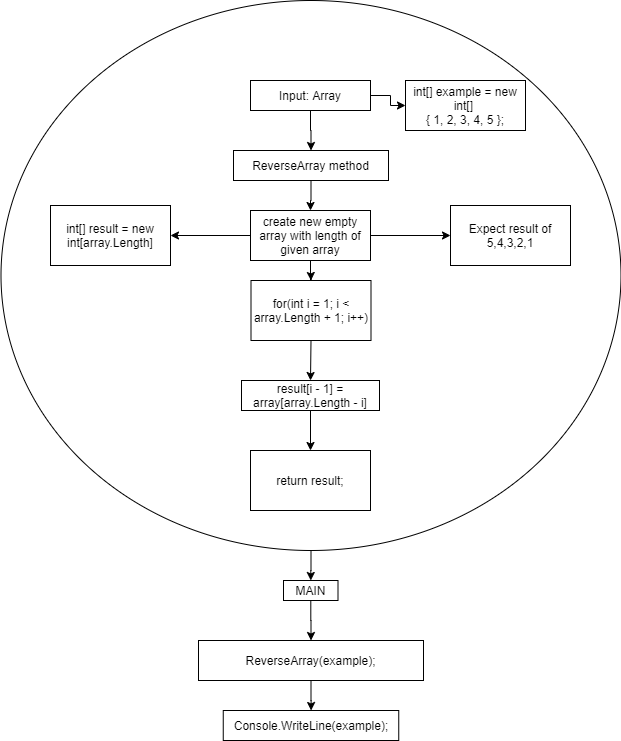

# Array Challenges

First Challenge - Reverse an Array  

Input: Array  
Output: Original array in reverse order  

  
  
  
  
Second Challenge - Insert and shift an array at the middle index  

Input: Array and value  
Output: Original array with the given value inserted into the middle index  

  
  
